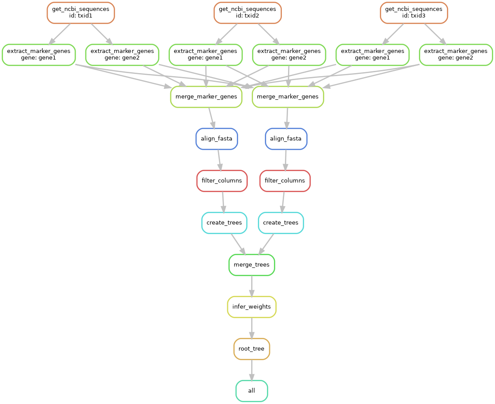

.. _quickstart:

=====================
Quickstart Guide
=====================

.. contents::
   :depth: 2

The pipeline is summarized by this DAG, which includes the steps in both the data curation library and the snakemake tree building

The first three rows are handled by the python library and from there things are handed off to snakemake.

Installation
************

The first steps are to clone this repo and then install `conda <https://docs.conda.io/projects/conda/en/latest/user-guide/install/index.html>`_ and `snakemake <https://snakemake.readthedocs.io/en/stable/getting_started/installation.html>`_. We can then install the Core Genes Extraction (CorGE) library and run tests to make sure everything is properly installed.

.. code-block:: shell

   git clone git@github.com:Ulthran/ShotgunUnifrac.git
   
   cd ShotgunUnifrac/CorGE
   pip install .

   cd ../
   pytest CorGE/tests/
   pytest .tests/

.. tip::

   If you've never installed Conda before, you'll need to add it to your shell's
   path. If you're running Bash (the most common terminal shell), the following
   command will add it to your path: ``echo 'export
   PATH=$PATH:$HOME/miniconda3/bin' > ~/.bashrc``

If you see "Tests failed", file an issue on `GitHub <https://github.com/Ulthran/ShotgunUnifrac/issues>`_.

Setup
*****

We'll start by creating some dummy inputs to work with using Escherichia coli, Buchnera aphidicola, Cellulomonas gilvus, Dictyoglomus thermophilum, and Methanobrevibacter smithii (a randomly selected group of gut bacteria plus Methanobrevibacter smithii as an outgroup for tree rooting).

.. code-block:: shell

    echo $'7\n9\n2173' > EX_TXIDS.txt
    echo $'GCF_000218545.1\nGCF_000020965.1' > EX_ACCS.txt

This creates two dummy input files

- ``EX_TXIDS.txt`` contains species-level taxon ids which CorGE will fetch genes and proteins for from NCBI.

- ``EX_ACCS.txt`` contains genome accessions which CorGE will fetch from NCBI.

.. tip::

    You can curate genomes/proteins from NCBI using taxon ids and genome accessions but you can also (in the same command) gather local genomes/proteins as well using the ``--local`` flag.

Data curation
---------------------

To gather the genes and proteins we need for tree building using the files we just created we use ``CorGE collect_genomes``. Then to filter single copy core genes (SCCGs) from each file and merge nucleotide/amino acid sequences by SCCG we use ``CorGE extract_genes``.

.. code-block:: shell

    CorGE collect_genomes --ncbi_species EX_TXIDS.txt --ncbi_accessions EX_ACCS.txt ./
    CorGE extract_genes ./

This should create the following directories and files from root

- ``assembly_summary.txt`` is downloaded from NCBI to find the best genome accessions for each taxon id.

- ``config.yml`` is provided to the snakemake pipeline to specify what it should look for and where.

- ``nucleotide`` is a directory containing all gathered nucleotide-encoded genomes (saved as .fna)

- ``protein`` is a directory containing all gathered protein-encoded genomes (saved as .faa)

- ``outgroup`` is a directory containing the nucleotide and protein files for the outgroup (if there is an outgroup)

- ``filtered-sequences`` is a directory containing each SCCG from each genome (protein-encoded) in their own files

- ``merged-sequences`` is a directory containing each SCCG from each genome this time in per-SCCG files

Tree building
------------------------

To build the per-SCCG phylogenies and then merge them together we use the snakemake pipeline. Everything should be properly set up from running CorGE so we can just go ahead and run the pipeline.

.. code-block:: shell
    snakemake all -c --use-conda --conda-prefix .snakemake/

This should create the following directories and files from root

- ``RAxML_outgroupRootedTree.final`` is the final consensus tree

- ``aligned-sequences`` is a directory containing alignments for the merged-sequences

- ``trees`` is a directory containing phylogenies built from each SCCG alignment as well as some intermediates in the merging process

.. tip::

    ``--use-conda`` causes snakemake to use per-rule defined conda environments while it runs the pipeline. ``--conda-prefix .snakemake/`` tells conda where to put/look for these environments.

Viewing results
***************

The output is ``RAxML_outgroupRootedTree.final`` which can be viewed using any newick-format tree viewer (like `ETE Toolkit <http://etetoolkit.org/treeview/>`_).

tl;dr
*****

Follow instructions to install `anaconda <https://docs.anaconda.com/anaconda/install/>`_ / `miniconda <https://docs.conda.io/en/latest/miniconda.html>`_ and `snakemake <https://snakemake.readthedocs.io/en/stable/getting_started/installation.html>`_ then,

.. code-block:: shell
    git clone git@github.com:Ulthran/ShotgunUnifrac.git
    cd ShotgunUnifrac
    echo $'7\n9\n2173' > EX_TXIDS.txt
    echo $'GCF_000218545.1\nGCF_000020965.1' > EX_ACCS.txt
    cd CorGE
    pip install .
    cd ..
    CorGE collect_genomes --ncbi_species EX_TXIDS.txt --ncbi_accessions EX_ACCS.txt ./
    CorGE extract_genes ./
    snakemake all -c --use-conda --conda-prefix .snakemake/

You should now have an output called `RAxML_outgroupRootedTree.final`.
